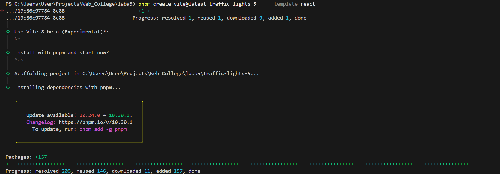
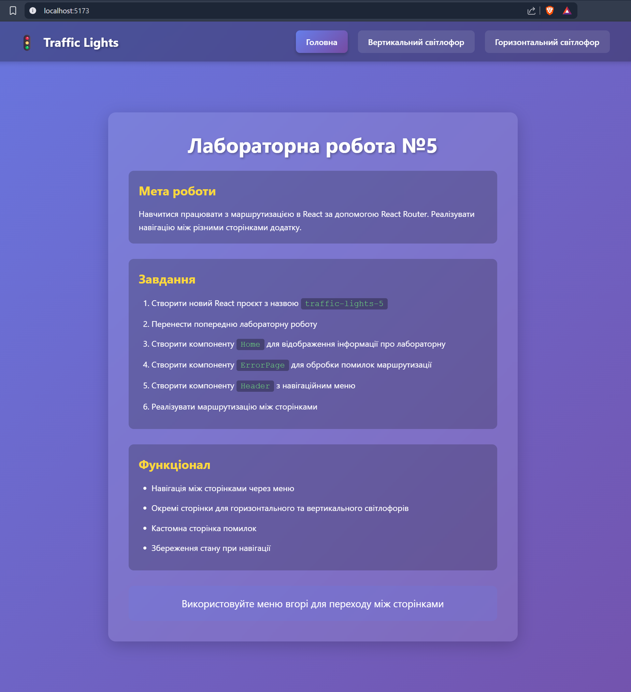
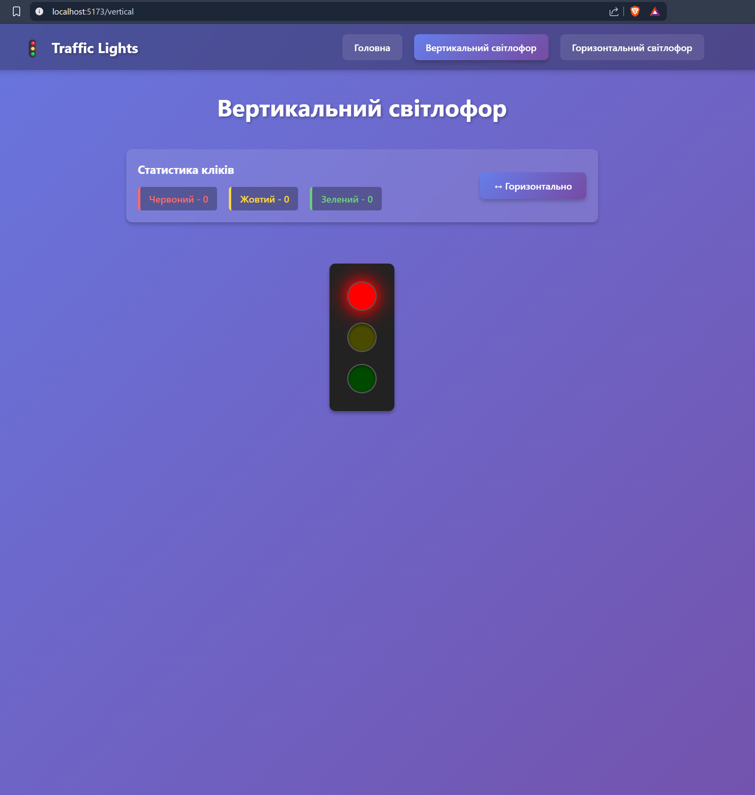
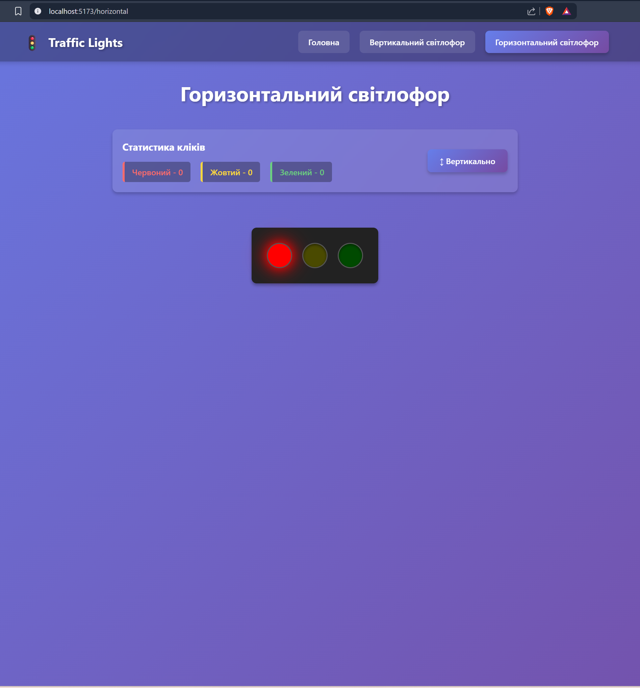
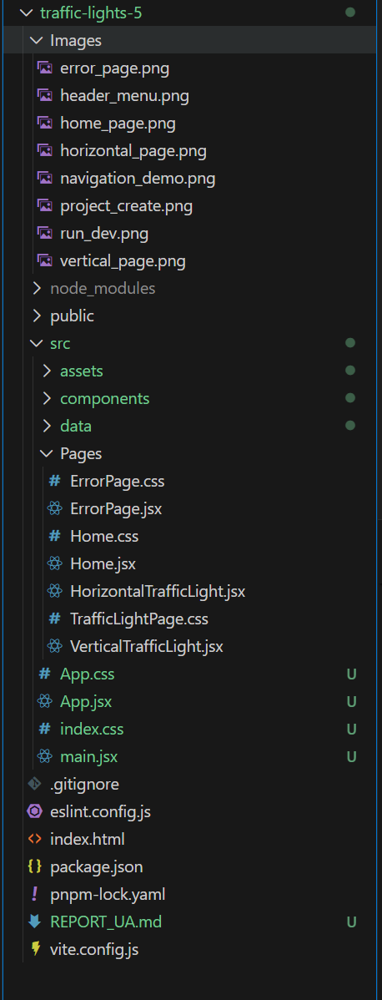
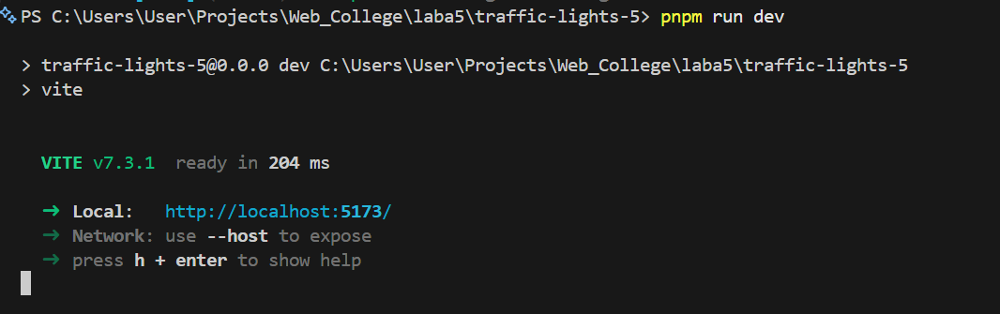

# Laboratory Report No. 5

**Student:** Andriy Vlonha  
**Group:** 42-CS  
**Date:** 16/02/2026

---

## Objective

To learn how to work with routing in React using React Router. Create a multi-page application with navigation menu.

---

## Procedure

---

### 1. Creating a New Project

Created a new React project named `traffic-lights-5`:

```bash
pnpm create vite@latest traffic-lights-5 -- --template react
cd traffic-lights-5
pnpm install
pnpm install prop-types
pnpm install react-router-dom
```

**Screenshot:**  
<div align="center">
  <figure>
    
    <br/>
    <sub><b>Fig. 1:</b> Creating new project traffic-lights-5</sub>
  </figure>
</div>

---

### 2. Transferring Components from Previous Lab

Transferred components:
- `Light.jsx` and `Light.css` - light component
- `TrafficLights.jsx` and `TrafficLights.css` - traffic lights component
- `StatsBar.jsx` and `StatsBar.css` - statistics component

**Description:**
- All components from previous lab preserved without changes
- File structure organized in `components` folder

---

### 3. Creating Home Component

**Functionality:**
- Display information about the laboratory work
- Description of goals and tasks
- List of implemented functionality
- Hint about using navigation menu

**Code: `src/Pages/Home.jsx`**

**Description:**
- Component contains information about lab tasks
- Styled using CSS with effects
- Responsive design for different screen sizes

**Screenshot:**  
<div align="center">
  <figure>
    
    <br/>
    <sub><b>Fig. 2:</b> Home page with lab description</sub>
  </figure>
</div>

---

### 4. Creating ErrorPage Component

**Functionality:**
- Custom page for handling routing errors
- Display error information (status, message)
- Button to return to home page
- Animations and visual effects

**Code: `src/Pages/ErrorPage.jsx`**

**Description:**
- Uses `useRouteError` hook to get error information
- Displays error code (404, 500, etc.)
- Styled for full-screen display
- Contains animated error icon

**Screenshot:**  
<div align="center">
  <figure>
    
    <br/>
    <sub><b>Fig. 3:</b> Error page with custom design</sub>
  </figure>
</div>

---

### 5. Creating Header Component

**Functionality:**
- Navigation menu with three items
- Application logo
- Active state for current page
- Responsive design for mobile devices

**Code: `src/components/Header.jsx`**

**Description:**
- Uses `NavLink` from React Router for navigation
- Automatic highlighting of active menu item
- Fixed positioning at top of screen
- Blur effect for background

**Menu Items:**
1. Home
2. Vertical Traffic Light
3. Horizontal Traffic Light

**Screenshot:**  
<div align="center">
  <figure>
    
    <br/>
    <sub><b>Fig. 4:</b> Header component with navigation menu</sub>
  </figure>
</div>

---

### 6. Creating Traffic Light Pages

**Components:**
- `VerticalTrafficLight.jsx` - vertical traffic light page
- `HorizontalTrafficLight.jsx` - horizontal traffic light page

**Functionality:**
- Independent click state for each page
- Statistics display through StatsBar
- Traffic light with corresponding orientation

**Code: `src/Pages/VerticalTrafficLight.jsx`**

**Description:**
- Each page has its own state for counting clicks
- Uses TrafficLights component with corresponding orientation
- Statistics displayed through StatsBar (without orientation change function)

**Screenshots:**  

<div align="center">

  
  <p><b>Figure 5.</b> Vertical traffic light page</p>
  <br/>

  
  <p><b>Figure 6.</b> Horizontal traffic light page</p>

</div>

---

### 7. Routing Configuration

**React Router Configuration:**
- Used `createBrowserRouter` to define routes
- Layout component with Header and Outlet
- Error handling through errorElement

**Code: `src/App.jsx`**

**Routes:**
- `/` - Home page (index route)
- `/vertical` - Vertical traffic light
- `/horizontal` - Horizontal traffic light
- `*` - ErrorPage for non-existent routes

**Description:**
- Layout component wraps all pages
- Header displayed on all pages (except ErrorPage)
- RouterProvider provides routing to application

---

### 8. Project Structure

**Screenshot:**  
<div align="center">
  <figure>
    
    <br/>
    <sub><b>Fig. 7:</b> Final project structure</sub>
  </figure>
</div>

---

### 9. Navigation Demo

**Navigation Screenshots:**  

<div align="center">

  
  <p><b>Figure 8.</b> Navigation between pages with active item highlighting</p>

</div>

---

### 10. Running the Project

```bash
cd traffic-lights-5
pnpm run dev
```

**Screenshot:**  
<div align="center">
  <figure>
    
    <br/>
    <sub><b>Fig. 9:</b> Result of executing <code>pnpm run dev</code> command</sub>
  </figure>
</div>

---

## Results

### Implemented Features:

1. **Routing:**
   - Configured React Router for navigation
   - Created three main routes
   - Error handling for non-existent routes through ErrorPage
   - Used Layout for shared elements

2. **Header Component:**
   - Navigation menu with three items
   - Active state for current page
   - Fixed positioning
   - Responsive design

3. **Home Page:**
   - Information about laboratory work
   - Description of goals and tasks
   - List of functionality
   - Stylish design

4. **ErrorPage:**
   - Custom error handling
   - Display error code and description
   - Button to return to home
   - Animations and effects

5. **Traffic Light Pages:**
   - Separate pages for vertical and horizontal modes
   - Independent state for each page
   - Statistics preservation during navigation

### Technical Details:

- **React Router v6:** createBrowserRouter, NavLink, Outlet, useRouteError
- **Layout Pattern:** Shared structure with Header for all pages
- **State Management:** Local state for each page
- **Navigation:** Programmatic navigation through Link and NavLink
- **Error Handling:** Custom error page
- **CSS:** Modular style organization for each component
- **Responsive Design:** Adaptability for different screen sizes

---

## Conclusion

During this laboratory work, I successfully:
- Mastered working with React Router v6
- Created a multi-page SPA application
- Implemented navigation menu with active states
- Created custom error handling page
- Organized project structure with separate pages
- Used Layout Pattern for shared elements
- Implemented programmatic navigation between pages

---

## References

- GitHub Repository: [link](https://github.com/AndriyVlonha/Lab5_WEB)
- React Router Documentation: https://reactrouter.com/en/main
- React Router Tutorial: https://reactrouter.com/en/main/start/tutorial
- NavLink API: https://reactrouter.com/en/main/components/nav-link
- useRouteError Hook: https://reactrouter.com/en/main/hooks/use-route-error
- Layout Routes: https://reactrouter.com/en/main/start/concepts#layout-routes

---
